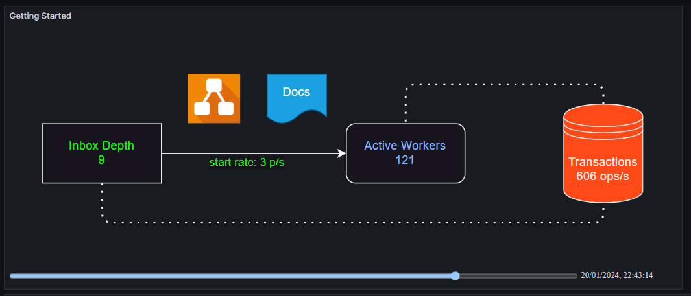
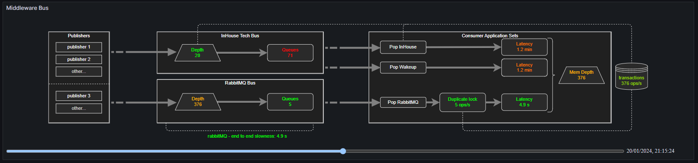

# Grafana Flow Panel Plugin
The Flow plugin provides side-by-side metric visualization on SVG diagrams. You provide the SVG diagram along with configuration on how you want the diagram to behave. The panel then combines these with your time-series data to bring your diagram to life.

## Example 1

## Example 2

## Example 3

## Getting Started
Follow the plugin [Getting Started](./src/README.md) guide to understand the target audience, feature set and how to use.

## Want to make changes?
Go to the [Grafana Getting Started](./grafana-getting-started.md) guide to get going with downloading a fork and setting up your test environment.
Once up you'll find dashboards available (sourced from the provisioning directory) that act as demonstrators for the functionality.
